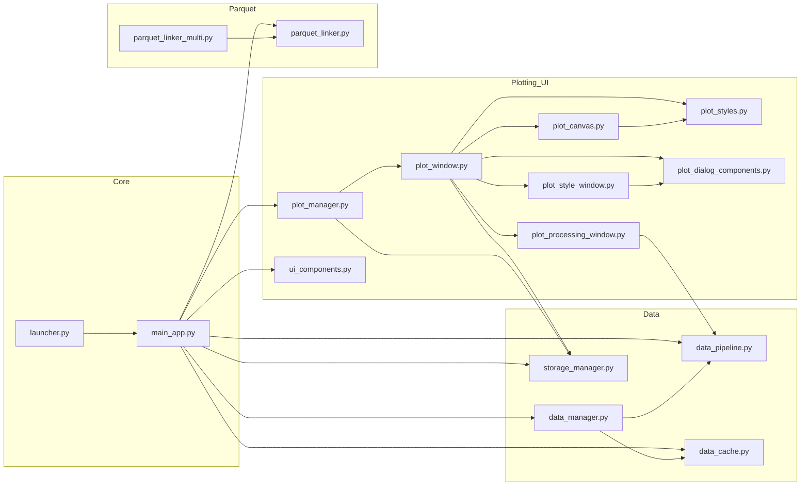

```mermaid
%% Mermaid: dépendances entre modules (A importe B ⇒ A --> B)
flowchart LR
  %% Sous-graphes pour lisibilité
  subgraph Core
    LA[launcher.py]
    MA[main_app.py]
  end

  subgraph Data
    DM[data_manager.py]
    DP[data_pipeline.py]
    DC[data_cache.py]
    SM[storage_manager.py]
  end

  subgraph Plotting_UI
    PW[plot_window.py]
    PC[plot_canvas.py]
    PS[plot_styles.py]
    PSW[plot_style_window.py]
    PDC[plot_dialog_components.py]
    PPW[plot_processing_window.py]
    PM[plot_manager.py]
    UI[ui_components.py]
  end

  subgraph Parquet
    PL[parquet_linker.py]
    PLM[parquet_linker_multi.py]
  end

  %% Dépendances principales (issues des imports)
  LA --> MA

  MA --> DM
  MA --> PM
  MA --> UI
  MA --> SM
  MA --> DP
  MA --> DC
  MA --> PL

  DM --> DC
  DM --> DP

  PW --> PC
  PW --> PSW
  PW --> SM
  PW --> PS
  PW --> PPW
  PW --> PDC

  PM --> SM
  PM --> PW

  PC --> PS

  PSW --> PDC

  PPW --> DP

  PLM --> PL

  %% Remarque: les dépendances externes (PyQt5, matplotlib, pandas, numpy) ne sont pas représentées.
```