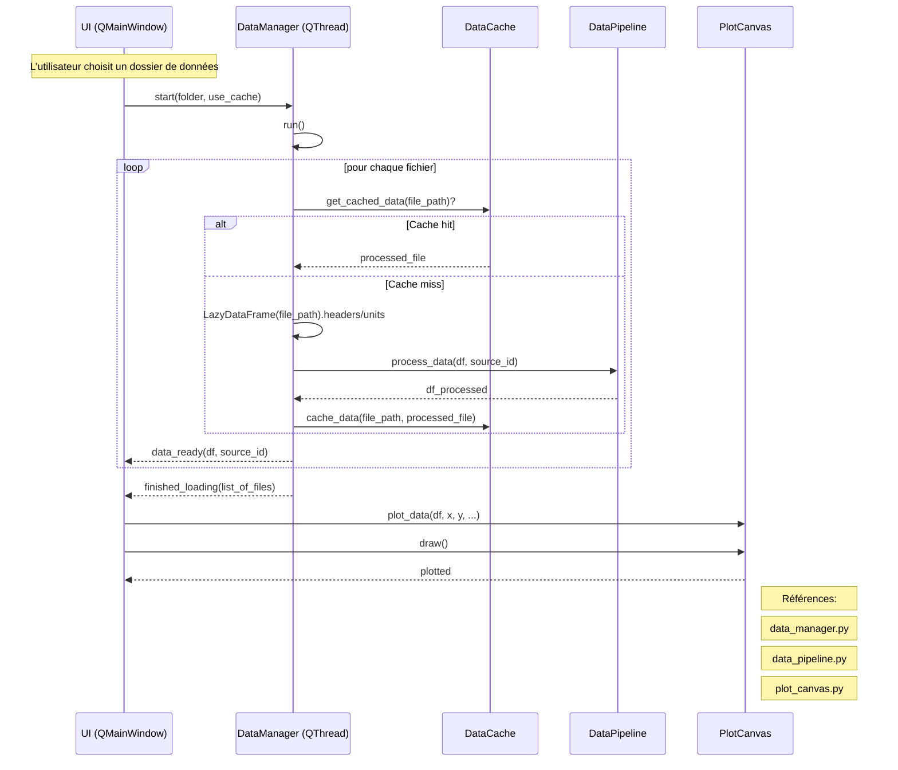

> ⚠️ **Doc legacy (desktop PyQt5 archivé)** — modules retirés de l'arbre. Voir
> [README.md](README.md). Code : tag `legacy-desktop-2026-06-21`.

```mermaid
%% Mermaid sequence: Use case principal "Charger → Traiter → Tracer"
sequenceDiagram
  participant UI as UI (QMainWindow)
  participant DM as DataManager (QThread)
  participant DC as DataCache
  participant DP as DataPipeline
  participant CAN as PlotCanvas

  Note over UI: L’utilisateur choisit un dossier de données
  UI->>DM: start(folder, use_cache)
  DM->>DM: run()
  loop pour chaque fichier
    DM->>DC: get_cached_data(file_path)?
    alt Cache hit
      DC-->>DM: processed_file
    else Cache miss
      DM->>DM: LazyDataFrame(file_path).headers/units
      DM->>DP: process_data(df, source_id)
      DP-->>DM: df_processed
      DM->>DC: cache_data(file_path, processed_file)
    end
    DM-->>UI: data_ready(df, source_id)
  end
  DM-->>UI: finished_loading(list_of_files)
  UI->>CAN: plot_data(df, x, y, ...)
  UI->>CAN: draw()
  CAN-->>UI: plotted

  Note right of CAN: Références:
  Note right of CAN: data_manager.py#DataManager.run / ._process_file_lazy
  Note right of CAN: data_pipeline.py#DataPipeline.process_data
  Note right of CAN: plot_canvas.py#PlotCanvas.plot_data / .draw
```
